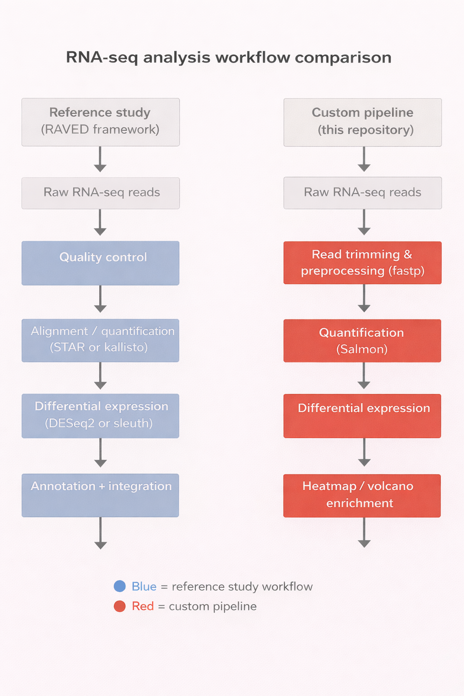

# RNA-seq Analysis Pipeline for Glucocorticoid Response in Asthma
## Overview

Asthma is a chronic inflammatory airway disease in which glucocorticoids are widely used as controller medications. However, some patients — particularly those with severe or refractory disease — show limited therapeutic response.

The reference study investigated transcriptomic responses to glucocorticoid exposure in airway smooth muscle (ASM) cells derived from donors with fatal asthma and from non-asthmatic donors. The study identified extensive differential gene expression and a distinct glucocorticoid-response signature enriched in immune-related pathways.

This project implements an independently designed RNA-seq analysis pipeline to reproduce a selected subset of those computational findings. Using a limited sample set and a fully custom workflow, raw data were reprocessed and key analytical outputs associated with glucocorticoid-induced transcriptional changes were regenerated.

The pipeline is modular, reproducible, and designed to operate under constrained computational resources using a controlled Conda environment and stepwise processing.

## Pipeline Workflow

  

**Figure 1.** Overview of the RNA-seq preprocessing, quantification, and downstream differential expression analysis pipeline.

### Main Outputs

-Gene-level count matrix

-Differential expression results

-Volcano plot

-Heatmap of selected genes

-Functional enrichment analysis

### Quick Start 

bash:

git clone https://github.com/ariyanfallahrad-collab/RNA-seq-Analysis-Pipeline-for-Glucocorticoid-Response-in-Asthma.git

cd RNA-seq-Analysis-Pipeline-for-Glucocorticoid-Response-in-Asthma

conda env create -f environment.yml

conda activate myenv

bash scripts/salmon_fastp_pipeline.sh

python scripts/analysis.py

### Repository Structure

scripts/         RNA-seq preprocessing, quantification, and analysis scripts

environment.yml  Conda environment specification

references/      Gene annotation and gene mapping files

results/         Generated outputs and figures

notebooks/       Jupyter notebooks for exploratory analysis

#### Data Sources

Reference Study:
https://pubmed.ncbi.nlm.nih.gov/30694689/

### RNA-seq Dataset

GEO accession: GSE94335
https://www.ncbi.nlm.nih.gov/geo/query/acc.cgi?acc=GSE94335

Samples Analyzed:

SRR5219989

SRR5219985

SRR5220016

SRR5219984

### System Requirements

macOS (10+) or Linux

8 GB RAM minimum

256 GB storage recommended

Terminal command line

Conda (Anaconda or Miniconda)

Windows Users:

Install Windows Subsystem for Linux (WSL):

https://learn.microsoft.com/windows/wsl/install

Installing Conda:

Install Anaconda or Miniconda for your operating system:

macOS / Linux: https://docs.conda.io/en/latest/miniconda.html

Windows: https://docs.conda.io/en/latest/miniconda.html

After installation, open a terminal (macOS/Linux) or Anaconda Prompt (Windows).

### Environment Setup

Place environment.yml in your working directory and run:

conda env create -f environment.yml

conda activate myenv

All pipeline commands must be executed inside the activated environment.

## Reference Transcriptome (GENCODE)

Human transcript nucleotide sequences were obtained from the GENCODE database.

To download the full transcriptome FASTA:

1. Visit the GENCODE human downloads page:  
   https://www.gencodegenes.org/human/

2. Navigate to:  
   **Fasta files → Transcript sequences → ALL**

3. Download the transcript FASTA file for the desired release.

This file contains nucleotide sequences for all annotated transcripts, including those on reference chromosomes, scaffolds, assembly patches, and alternate loci.

Ensure it is present in the working directory before running the pipeline.

#### RNA-seq Preprocessing and Quantification

Run:

bash scripts/salmon_fastp_pipeline.sh

This step:

Downloads SRA data

Converts reads to FASTQ

Performs trimming and quality control (fastp)

generates QC reports

Performs Salmon pseudoalignment and quantification

Outputs:

-Raw SRA files

-Trimmed FASTQ files

-QC reports

-Salmon quant.sf files

-Gene Identifier and Mapping Generation

#### After quantification, the following files are constructed, the mapping and gene_ids files can be generated through any salmon quant.sf file

bash:

cat salmon_SRR5219989/quant.sf |  cut -d "|" -f 2,6 | tr "|" " " | egrep -v "Name" | sort -u | awk '{ split($1, a, "."); print a[1], $2 }' > gtf.mapping.csv

cat salmon_SRR5219989/quant.sf |  cut -d "|" -f 2,6 | tr "|" " " | egrep -v "Name" | sort -u | awk '{ split($1, a, "."); print a[1], $2 }' > ALLgene_ids.csv — version-cleaned gene identifiers

ALLgene_ids.csv — version-cleaned gene identifiers

gtf.mapping.csv — transcript-to-gene mapping file

These files enable transcript-to-gene aggregation.

Count Matrix Construction

Gene-level counts are generated by aggregating Salmon transcript-level quantification.

Required Annotation Resources

1. Standardized gene identifiers
   
Ensembl gene identifiers may include version suffixes (e.g., .1, .2).
These are removed using sed to create consistent identifiers (ALLgene_ids.csv).

2. Transcript-to-gene mapping file

Extracted from quant.sf outputs (gtf.mapping.csv) to link transcripts to gene symbols.

Using these resources, transcript abundances are aggregated into a gene-level count matrix (genes × samples).

#### Downstream Analysis:

Run:

python scripts/analysis.py

This step performs:

-Count matrix processing 

-Metadata integration

-Differential expression analysis using PyDESeq2

-Visualization generation

### Computational Workflow (Python Stage)

Salmon quantification

→ transcript-to-gene aggregation

→ gene count matrix

→ metadata integration

→ PyDESeq2 object

→ differential expression results

→ visualization (volcano plot, heatmap)

### Results

Differential expression analysis identified significant transcriptional changes associated with glucocorticoid exposure. The volcano plot revealed a clear separation of upregulated and downregulated genes, with a subset of genes showing strong statistical significance and large effect sizes. Several transcripts exhibited substantial downregulation, indicating robust treatment-associated suppression of gene expression.

Hierarchical clustering of differentially expressed genes was visualized using a heatmap of selected significant genes. The heatmap demonstrated distinct expression patterns between experimental conditions, with clear sample clustering consistent with treatment status. This separation supports the presence of coordinated transcriptional responses to glucocorticoid exposure.

Functional enrichment analysis was performed using g:Profiler on the top downregulated genes. Gene Ontology analysis revealed significant enrichment in molecular functions related to protease regulation and enzymatic activity, including peptidase regulator activity, peptidase inhibitor activity, and hydrolase activity. Cellular component enrichment indicated strong overrepresentation of extracellular space and extracellular region terms. These findings suggest that glucocorticoid exposure is associated with reduced expression of genes involved in extracellular signaling, proteolytic regulation, and tissue remodeling processes.

In contrast, enrichment analysis of upregulated genes did not reveal statistically significant or biologically coherent functional categories. Consequently, downstream functional interpretation focused on the downregulated gene set.

Overall, the results indicate that glucocorticoid treatment induces coordinated suppression of extracellular and protease-related pathways, consistent with known anti-inflammatory and tissue regulatory effects of glucocorticoids.

### Discussion — Statistical Power and Sample Size Limitations

The statistical significance of the observed differential expression and enrichment results should be interpreted with caution due to the limited number of samples analyzed in this study. Small sample sizes reduce statistical power, which increases variability in gene expression estimates and decreases the precision of p-value calculations. As a result, true biological effects may fail to reach statistical significance (increased false negatives), while estimated effect sizes and associated p-values may be less stable and more sensitive to individual sample variation.

This limitation also affects downstream functional enrichment analyses, where reduced gene list size and statistical power can influence the robustness of pathway detection and significance estimates. Consequently, although the observed transcriptional patterns and enriched functional categories are biologically plausible and consistent with known glucocorticoid responses, the statistical strength of these findings is inherently constrained by sample size.

Future studies with larger cohorts will be necessary to improve statistical power, refine effect size estimates, and confirm the reproducibility of the observed transcriptional and functional changes.

### Conclusion

This project demonstrates that key transcriptional response patterns associated with glucocorticoid exposure in asthma can be reproduced using an independent RNA-seq analysis pipeline. Despite reduced statistical power and methodological differences, biologically meaningful gene expression trends and pathway enrichment were observed.

The pipeline provides a reproducible and modular framework for RNA-seq analysis under practical computational constraints and serves as an educational implementation of transcriptomic data processing, differential expression analysis, and functional interpretation.
